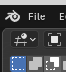
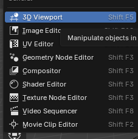
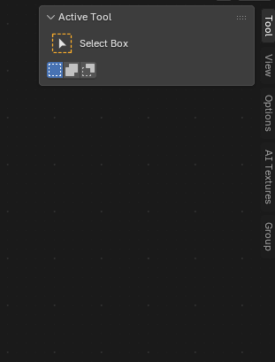

# ☁️ CLOUD MODE - Free Cloud GPU Setup

## What This Is

Run AI Texture Generator using **free cloud GPUs** from Kaggle — no powerful computer needed!

Perfect if you don't have a GPU or want to try without installing anything.

---

## 📋 What You Need

- Kaggle account (free) - [Sign up here](https://www.kaggle.com)
- Phone number verification (for GPU access)
- Internet connection
- Blender 4.0+

---

## 🚀 Setup (5 Minutes!)

### Step 1: Create Kaggle Notebook

1. Go to [kaggle.com/code](https://www.kaggle.com/code)
2. Click **"New Notebook"**
3. Name it: "AI Texture Backend"

### Step 2: Enable GPU

1. Click **⚙️ Settings** (right sidebar)
2. Under "Accelerator", select **"GPU T4 x2"**
3. Click **"Save"**

### Step 3: Add Backend Code

1. Open `googlecolabobackend.py` from this folder
2. **Copy entire file contents** (Ctrl+A, Ctrl+C)
3. **Paste into Kaggle notebook** (Ctrl+V)

### Step 3.5: Set Your Ngrok Token

**Important:** You need a free ngrok account!

1. Go to [ngrok.com](https://ngrok.com) and sign up (free)
2. Go to [dashboard.ngrok.com/get-started/your-authtoken](https://dashboard.ngrok.com/get-started/your-authtoken)
3. Copy your auth token
4. In the Kaggle notebook, find this line (near the bottom):
   ```python
   NGROK_AUTH_TOKEN = "please enter your ngrok token here"
   ```
5. Replace `"please enter your ngrok token here"` with your token:
   ```python
   NGROK_AUTH_TOKEN = "your_actual_token_here"
   ```

### Step 4: Run Notebook

1. Click **"Run All"** button (or press Shift+Enter in each cell)
2. Wait 2-3 minutes for model to load
3. Look for output:
   ```
   ====================================
   🌐 PUBLIC URL (copy this to Blender):
   ====================================
   http://abc123.ngrok.io
   ====================================
   ```
4. **Copy this URL!** (e.g., `http://abc123.ngrok.io`)

### Step 5: Install Blender Addon

1. **In Blender:**
   - Edit → Preferences → Add-ons
   - Click "Install..."
   - Select `blender_ai_textures.py` from this folder
   - Enable the addon checkbox

2. **Switch to Shading workspace** (top menu bar)
3. **Press N** to show sidebar
4. Click **"AI Textures"** tab

### Step 6: Connect to Kaggle

1. Find **"Backend URL"** field in AI Textures panel
2. **Paste your ngrok URL** (e.g., `http://abc123.ngrok.io`)
3. Should show **"✓ Connected"**

### Step 7: Using the Addon in Blender

#### 7.1 Switch to Shader Editor

1. **Click the workspace icon** (top-left corner of Blender):



2. Select **"Shader Editor"** from the dropdown:



#### 7.2 Access AI Textures Panel

1. **Look at the right sidebar** in Shader Editor
2. **Click the "AI Textures" tab** (you may need to press `N` if sidebar is hidden)



#### 7.3 Select Your Object

1. In the 3D viewport (or outliner), **select the object** you want to texture
2. The object name will appear in the "Target Object" dropdown in the AI Textures panel

#### 7.4 Generate Textures

1. Choose a **material preset** (e.g., "Rusted Metal", "Oak Wood")
2. Select **resolution** (start with 1024px)
3. Check **"Seamless Tiling"** if needed (for floors/walls)
4. Click **"Generate Textures"** button
5. **Wait 3-5 minutes** for generation to complete

#### 7.5 View Your Textured Object

1. **Click the workspace icon** again (top-left)
2. Select **"3D Viewport"** (or press `Shift+F5`)

3. **If texture doesn't appear**, change viewport shading:
   - Look for shading icons (top-right of viewport)
   - Click **"Material Preview"** (3rd icon) or press `Z` → Material Preview

#### 7.6 Adjust Texture Scale (Optional)

1. Press `N` to show the sidebar (if hidden)
2. Navigate to **"AI Textures"** tab
3. Under "Texture Scale", adjust **X, Y, Z** values:
   - **Higher values** = Texture repeats more (appears smaller)
   - **Lower values** = Texture appears larger
4. Click **"Apply Scale"** to update

---

## 💡 Quick Reference

**Keyboard Shortcuts:**
- `N` - Toggle sidebar on/off
- `Z` - Viewport shading menu
- `Shift+F5` - Switch to 3D Viewport
- `Shift+F3` - Switch to Shader Editor

**Viewport Shading Modes:**
- **Solid** - No textures visible
- **Material Preview** - See textures ✅
- **Rendered** - Full render preview

---

---

## 💡 Important Tips

### URL Changes Every Session
⚠️ **The ngrok URL changes each time you restart the Kaggle notebook**

When you restart:
1. Get new ngrok URL from Kaggle output
2. Update URL in Blender addon
3. That's it!

### Keep Notebook Running
- Keep the Kaggle browser tab open while generating
- Don't close or stop the notebook during generation
- Notebook auto-stops after 12 hours of inactivity

### Free Tier Limits
- **30 hours/week** of GPU time (plenty for hobbyists!)
- **12 hours max** per session
- Sessions timeout after inactivity

---

## 🎯 Daily Workflow

**Each time you want to generate textures:**

1. Open Kaggle → Your "AI Texture Backend" notebook
2. Click "Run All"
3. Copy new ngrok URL
4. Paste into Blender addon
5. Generate textures!

**That's it!** 🚀

---

## 🐛 Troubleshooting

### "Cannot connect to backend"
- Make sure Kaggle notebook is running
- Check you copied the full ngrok URL (including `http://`)
- Verify notebook didn't timeout (12-hour limit)

### "GPU quota exceeded"
- You've used 30 hours this week
- Wait until next week OR use Google Colab instead
- Colab: Upload same code, should work identically

### "Generation timeout"
- Kaggle session might have stopped
- Restart notebook, get new URL, try again
- Lower resolution (try 1024px instead of 4K)

### URL keeps changing
- This is normal! ngrok gives new URL each restart
- Just update in Blender each time
- Or use LOCAL_MODE for permanent URL

---

## ⚡ Advantages

✅ **Free cloud GPU** - No expensive hardware needed  
✅ **Works on any PC** - Even Chromebooks!  
✅ **Easy setup** - Just copy-paste code  
✅ **No installation** - Everything runs in browser  
✅ **30 hours/week free** - Generous for hobbyists  

## ⚠️ Limitations

❌ **Requires internet** - During generation  
❌ **URL changes** - Each restart (minor inconvenience)  
❌ **12-hour sessions** - Have to restart occasionally  
❌ **30 hour/week limit** - Not for heavy commercial use  

---

## 🔄 Alternative: Google Colab

**Same setup works on Google Colab!**

1. Go to [colab.research.google.com](https://colab.research.google.com)
2. New Notebook → Paste `googlecolabobackend.py`
3. Runtime → Change runtime type → GPU
4. Run all cells → Copy ngrok URL
5. Use in Blender!

**Colab gives you more hours if you run out on Kaggle!**

---

## 📊 Cost Comparison

| Service | GPU Hours/Week | Cost |
|---------|----------------|------|
| **Kaggle** | 30 hours | **FREE** ✅ |
| **Google Colab** | ~15 hours | **FREE** ✅ |
| **Our Cloud Mode** | Combined | **$0** 💰 |
| RunPod / Lambda | Unlimited | $0.20-0.50/hour |
| Your own RTX 4090 | Unlimited | $1,600 upfront |

---

## 🤝 Need More Power?

If you need more than 30 hours/week:

1. **Use both Kaggle + Colab** (45+ hours combined!)
2. **Switch to LOCAL_MODE** (unlimited, needs GPU)
3. **Pay for cloud GPU** (RunPod, Lambda Labs)

For most users, free tier is plenty! 🎉

---

## 📚 Files in This Folder

- `README.md` (this file) - Setup guide
- `blender_ai_textures.py` - Blender addon
- `googlecolabobackend.py` - Kaggle/Colab backend code
- `requirements.txt` - Dependencies (auto-installed

 by notebook)

---

**Questions? Check the main README.md or open an issue!**

**Happy texture generating! 🎨☁️**
